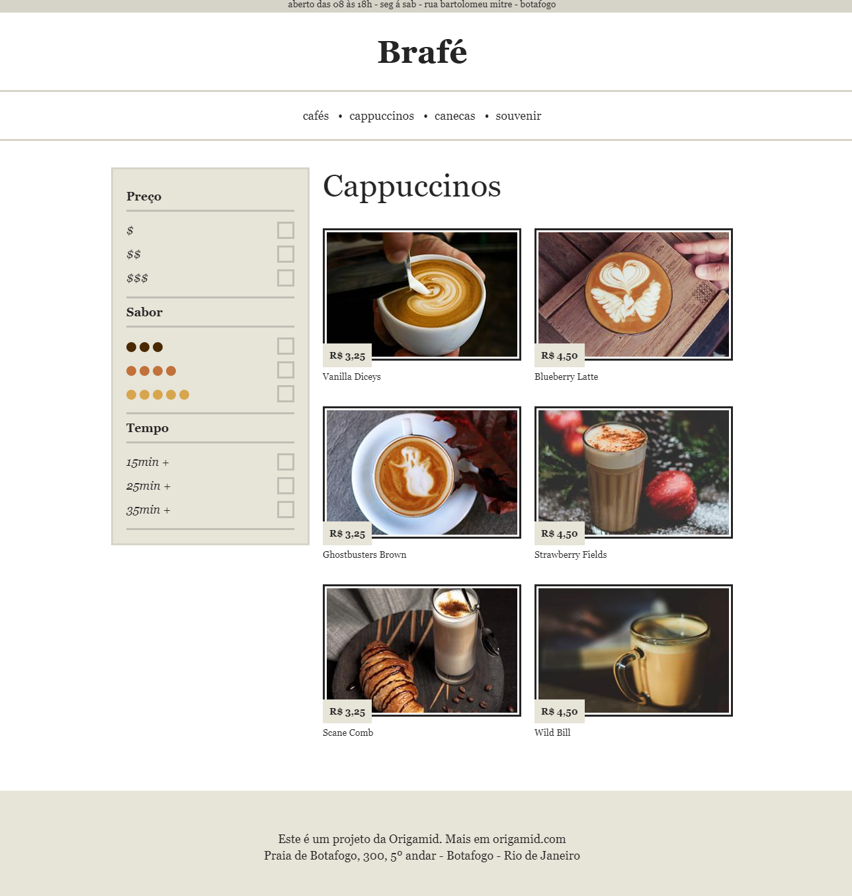

# Brafé 2

<!----ts----------->
Projeto de um website simulando uma rede de cafeterias do Rio de Janeiro, criado durante o curso de CSS Avançado focado em posicionamento da Origamid.

Foram usados para montar o layout 4 formas de posicionamento:   CSS PURO | Grid | Flexbox | Bootstrap

<h1 align="center">
    
</h1>
